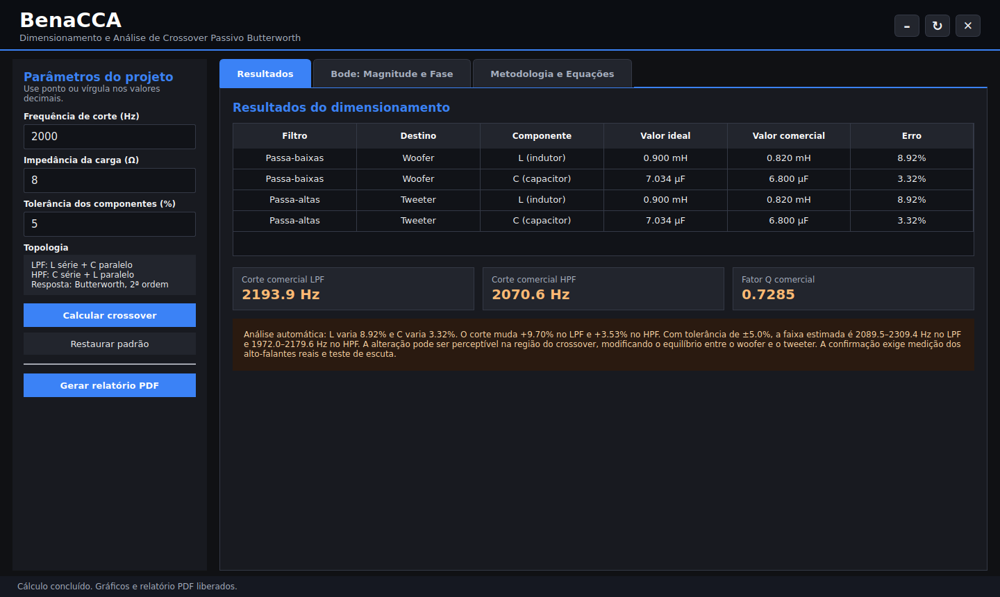
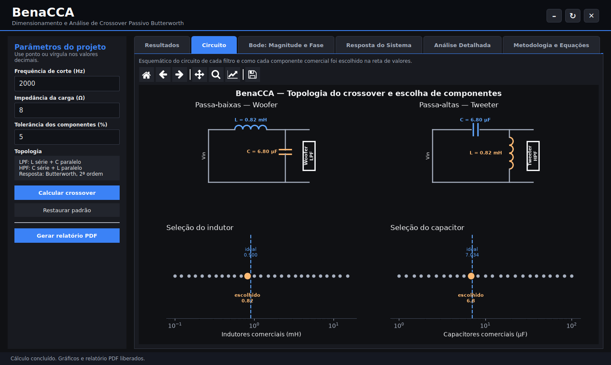
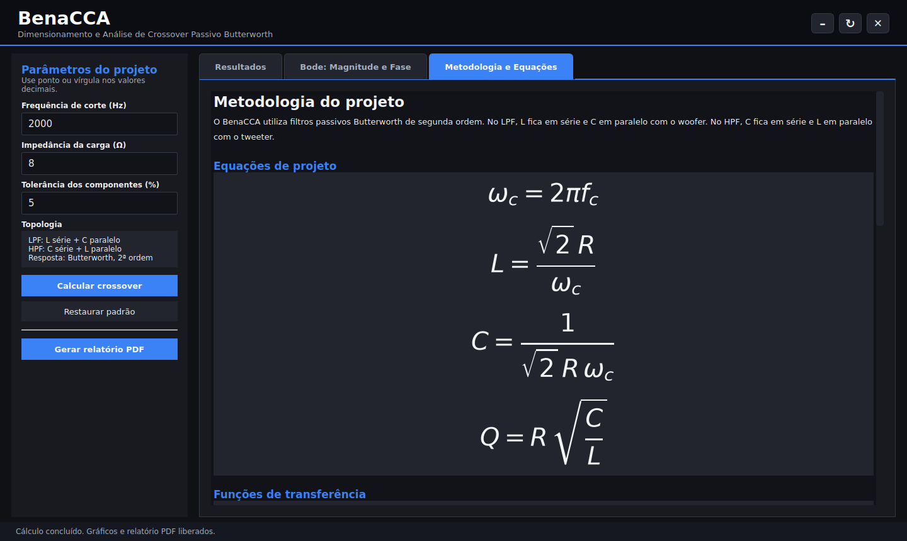
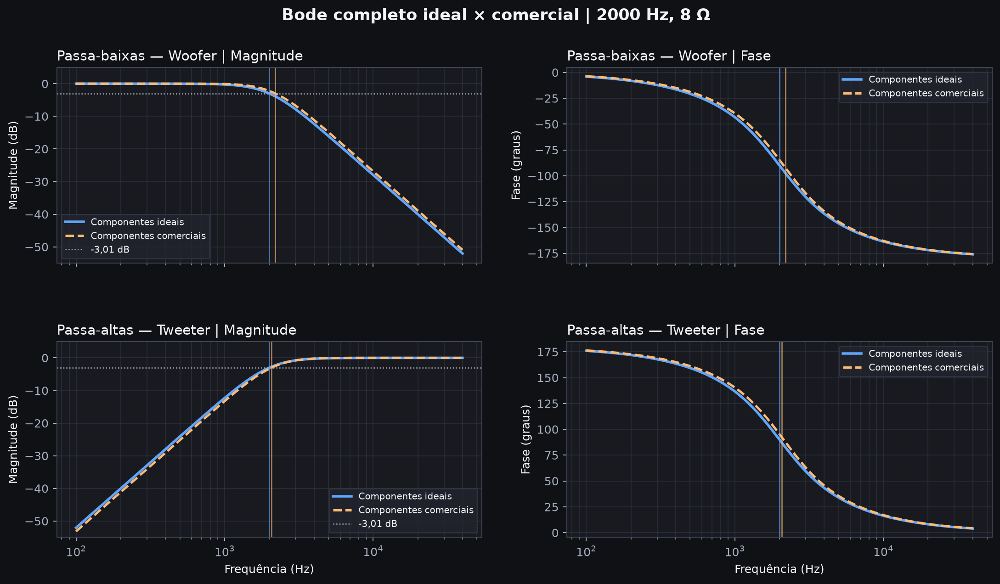
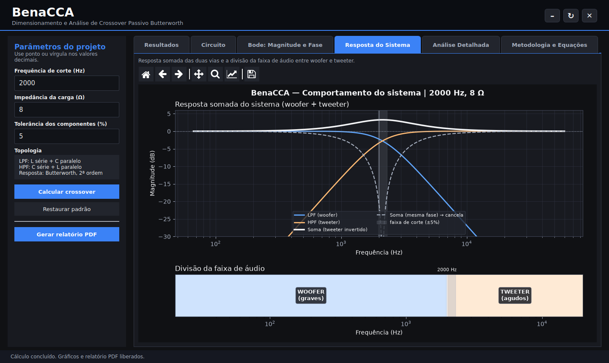
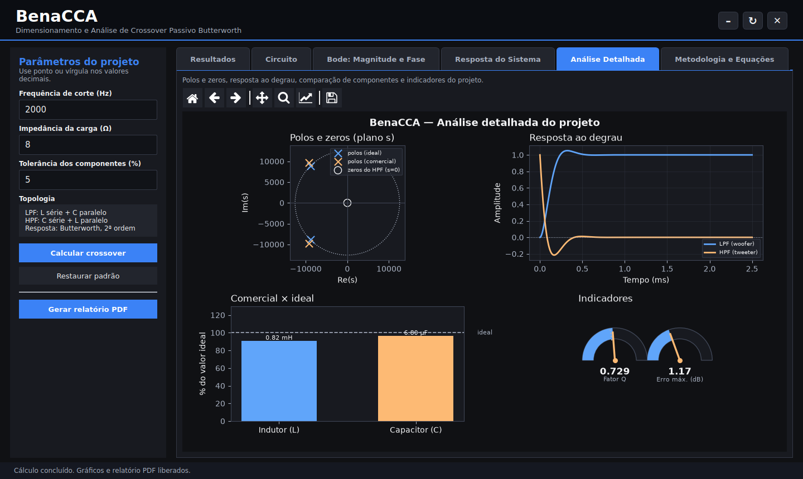

# BenaCCA — Projeto de Crossover Passivo

**Autor:** Matheus Augusto de Paula OLiveira
**Disciplina:** Circuitos de Corrente Alternada — CC44CP  
**Professor:** Lucas Bernardo Zilch

## Apresentação do problema

Uma caixa de som de duas vias precisa separar o sinal que vai para cada
alto-falante. O woofer deve receber as frequências baixas e o tweeter, as
frequências altas. Essa separação é feita por um crossover.

Neste trabalho foi desenvolvido um programa em Python para projetar um
crossover passivo Butterworth de segunda ordem. A ferramenta calcula os
componentes ideais, escolhe os valores comerciais permitidos pelo enunciado e
compara as duas respostas por meio de gráficos de Bode.



## Objetivos e especificações

O projeto considera:

- filtro passa-baixas (LPF) para o woofer;
- filtro passa-altas (HPF) para o tweeter;
- resposta Butterworth de segunda ordem;
- frequência de corte de `2 kHz`;
- carga resistiva de `8 Ω`;
- seleção de indutores e capacitores somente entre os valores fornecidos nas
  tabelas do enunciado.

O programa também permite testar outras frequências, impedâncias e tolerâncias,
mas os resultados apresentados neste README usam o caso obrigatório de
`2 kHz` e `8 Ω`.

## Modelagem dos filtros

No LPF, o indutor fica em série e o capacitor em paralelo com o woofer:

```text
Entrada ── L ──┬── Saída / R
               │
               C
               │
              GND
```

No HPF, o capacitor fica em série e o indutor em paralelo com o tweeter:

```text
Entrada ── C ──┬── Saída / R
               │
               L
               │
              GND
```

A aba **Circuito** desenha os dois esquemáticos com os valores já preenchidos e
mostra, numa reta de valores, qual componente comercial foi escolhido em
relação ao ideal:



As funções de transferência usadas no código são:

```text
                 R
H_LPF(s) = -----------------
           R + Ls + RLCs²

               RLCs²
H_HPF(s) = -----------------
           R + Ls + RLCs²
```

Para obter uma resposta Butterworth de segunda ordem:

```text
ωc = 2πfc

L = √2 R / ωc

C = 1 / (√2 R ωc)
```

Com `fc = 2000 Hz` e `R = 8 Ω`, a frequência angular é
`ωc = 12566,37 rad/s`.

A aba **Metodologia e Equações** do próprio programa apresenta essas fórmulas
já renderizadas:



## Lógica do programa

O funcionamento foi separado em blocos dentro do arquivo `BenaCCA.py`:

1. leitura e validação da frequência, impedância e tolerância;
2. cálculo dos valores ideais de `L` e `C`;
3. comparação com as tabelas comerciais do enunciado;
4. escolha do valor com a menor diferença absoluta;
5. cálculo das respostas complexas do LPF e do HPF;
6. localização numérica dos pontos de `−3,01 dB`;
7. geração dos gráficos de magnitude e fase;
8. apresentação dos resultados na interface;
9. geração opcional de um relatório em PDF.

As tabelas comerciais ficam declaradas no início do código. Os cálculos são
feitos em unidades do SI: henry, farad, ohm e hertz.

## Como executar

É necessário ter Python 3.10 ou mais recente com a biblioteca PyQt6.

Dentro da pasta `Codigo Fonte`, instale as bibliotecas:

```bash
python -m pip install -r requirements.txt
```

Depois execute:

```bash
python BenaCCA.py
```

No Windows, o arquivo `executar_benacca.bat` também inicia o programa.

Na interface:

1. informe a frequência de corte e a impedância;
2. clique em **Calcular crossover**;
3. consulte os componentes na aba **Resultados**;
4. abra a aba **Bode: Magnitude e Fase** para comparar as curvas;
5. passe o mouse sobre o gráfico para ler os valores;
6. use **Gerar relatório PDF** se quiser salvar uma cópia dos resultados.

## Resultados

Para `2 kHz` e `8 Ω`, foram obtidos:

| Componente | Valor ideal | Valor comercial | Diferença |
|---|---:|---:|---:|
| Indutor | 0,9003 mH | 0,82 mH | 8,92% |
| Capacitor | 7,0337 µF | 6,8 µF | 3,32% |

Os valores de `0,82 mH` e `6,8 µF` são os mais próximos disponíveis nas
tabelas exigidas para o trabalho.

Com esses componentes, os pontos de corte calculados são:

| Filtro | Corte ideal | Corte com componentes comerciais | Desvio |
|---|---:|---:|---:|
| LPF / woofer | 2000 Hz | 2193,9 Hz | +9,70% |
| HPF / tweeter | 2000 Hz | 2070,6 Hz | +3,53% |

O fator de qualidade obtido com os componentes comerciais é `Q = 0,7285`.

## Gráfico de Bode



As curvas azuis representam os valores ideais. As curvas laranjas tracejadas
usam os componentes comerciais. A coluna da esquerda mostra a magnitude e a
coluna da direita mostra a fase.

## Resposta do sistema

Além das respostas individuais, a aba **Resposta do Sistema** mostra a soma das
duas vias e a divisão da faixa de áudio entre woofer e tweeter. Como um
crossover de 2ª ordem deixa as vias 180° defasadas no corte, a soma em fase se
cancela (curva tracejada); invertendo a polaridade do tweeter o sistema soma
corretamente (curva clara), com o leve realce típico do Butterworth:



## Análise detalhada

A aba **Análise Detalhada** reúne os polos e zeros no plano s (os polos do
Butterworth ficam sobre o círculo de raio `ωc`), a resposta ao degrau no
domínio do tempo, a comparação entre componentes comerciais e ideais e
indicadores do fator `Q` e do maior erro de magnitude:



## Análise crítica

O maior erro ocorreu no indutor: o valor comercial ficou `8,92%` abaixo do
ideal. No capacitor, a diferença foi de `3,32%`. Como os dois componentes
influenciam a frequência natural e o amortecimento, a substituição deslocou os
pontos de corte dos filtros.

O deslocamento foi maior no LPF, que passou de `2000 Hz` para `2193,9 Hz`. No
HPF, o corte foi para `2070,6 Hz`. Isso altera a região em que woofer e tweeter
dividem o sinal.

A mudança pode ser percebida perto da frequência de crossover, mas não é
possível afirmar que será audível em qualquer caixa. O resultado final também
depende dos alto-falantes, da caixa acústica, do ambiente e da tolerância real
dos componentes. O modelo usado aqui considera a carga como uma resistência
constante de `8 Ω`, enquanto um alto-falante real tem impedância variável com a
frequência.

Como verificação adicional, o programa avalia tolerância de `±5%`. Nesse caso,
a faixa estimada de corte fica entre `2089,5 Hz` e `2309,4 Hz` no LPF, e entre
`1972,0 Hz` e `2179,6 Hz` no HPF.

## Conclusão

O projeto atingiu o objetivo proposto: os dois filtros foram dimensionados, os
componentes comerciais foram escolhidos a partir das tabelas permitidas e as
respostas ideal e real foram comparadas no gráfico de Bode.

O principal desafio foi passar dos valores calculados para componentes que
realmente existem. Essa etapa mostrou que um projeto não termina na fórmula:
mesmo uma escolha comercial próxima pode alterar a frequência de corte, e por
isso a resposta final precisa ser analisada antes da montagem.

## Arquivos do repositório

```text
.
├── Aplicativo/
├── Codigo Fonte/
│   ├── BenaCCA.py
│   ├── requirements.txt
│   └── executar_benacca.bat
├── Documentação Academica/
│   ├── RELATORIO_ACADEMICO.md
│   ├── Enunciado - Projeto Final.pdf
│   └── Imagens/
├── LICENSE
└── README.md
```
